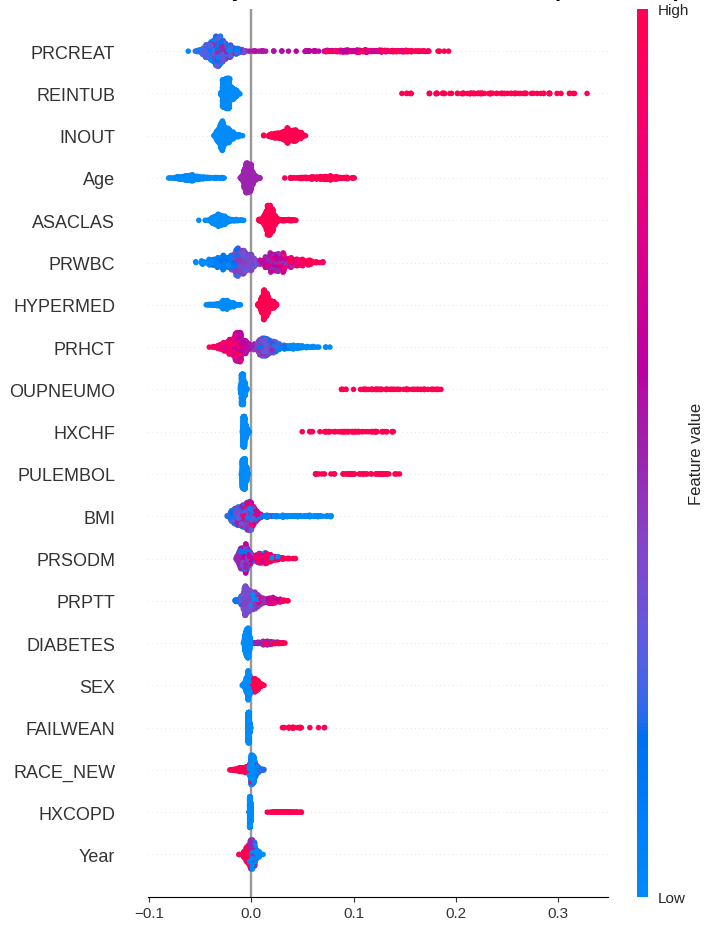
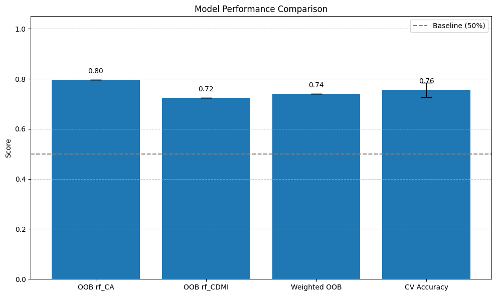

# Uncertainty-Aware_XAI_to_Predict_CardiacEvents_after_TKA_THA

## Table of Contents
- [Abstract](#abstract)
- [Directory Descriptions](#directory-descriptions)
- [The Proposed Computational Pipeline](#the-proposed-computational-pipeline)
- [Data Availability](#data-availability)
- [Publications](#publications)
- [Acknowledgments](#acknowledgments)
- [Citation](#citation)
- [Support By](#support-by)
  
### Abstract  

This GitHub repository includes all Python codes, dataset, figures, models, and presentation slides that support the study. Together, these resources provide an uncertainty-aware explainable AI framework to predict 30-day major adverse cardiac events following total knee arthroplasty (TKA) and total hip arthroplasty (THA).

The framework combines risk prediction, uncertainty quantification, and explainability (SHAP and LIME) to enhance transparency and clinical utility. We used the NSQIP dataset, focusing on patient-level clinical features. Raw data cannot be shared here, but the code, model structures, and pipeline are provided.

### Directory Descriptions
+ 
<strong>Code:</strong> This directory contains all Python scripts and notebooks used for model training, evaluation, and explainability analyses.
  
+ 
<strong>Dataset:</strong> This directory used the NSQIP dataset, focusing on patient-level clinical features.
  
+ 
<strong>Figures:</strong> This directory contains figures and visualizations generated for the study, including performance plots and explainability results.
  
+ 
<strong>Models:</strong> This directory includes the trained AI models and related configuration files.
  
+ 
<strong>Presentation:</strong> This directory contains presentation slides for communicating project results.

### The Proposed Computational Pipeline 

  
  

### Data Availability
The NSQIP dataset is available only through authorized access. As per policy, raw data cannot be shared in this repository.

### Publications

  <strong>Uncertainty-Aware Explainable AI to Predict Major Adverse Events in TKA/THA</strong>

  <strong>Trustworthy and Uncertainty-Aware AI for Predicting Respiratory Complications Following TKA/THA</strong> 
  <em>Accepted at AMIA Annual Symposium, 2025.</em>

### Acknowledgments

The authors thank the 
<a href="https://www.facs.org/" target="_blank">American College of Surgeons</a>, 
particularly the 
<a href="https://www.facs.org/quality-programs/acs-nsqip/" target="_blank">National Surgical Quality Improvement Program (NSQIP)</a> 
for the datasets utilized in this research contribution.

### Citation

This contribution is fully described in our manuscript, entitled 
"<i>Uncertainty-Aware Explainable AI to Predict Major Adverse Events in TKA/THA</i>", 2025.  
Any publication or use of this work should cite this manuscript accordingly.

### Support By

  

